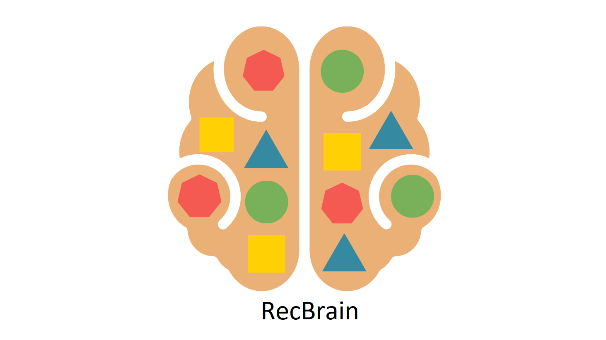
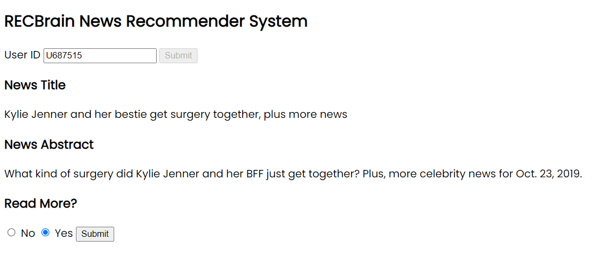
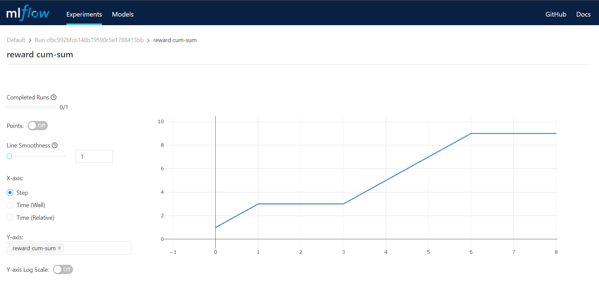

 

    
  <h3 align="center">News Recommender System with Online Reinforcement Learning</h3>
  

## Table of Content
- [General Info](#general-info)
- [Technologies](#technologies)
- [Setup](#setup)
- [Features](#features)
- [Screenshots](#screenshots)
- [About Us](#about-us)
- [Acknowledgement](#acknowledgement)

## General Info
We implemented a News Recommender System with an Online Reinforcement Learning approach, based on [MIND](https://www.microsoft.com/en-us/research/publication/mind-a-large-scale-dataset-for-news-recommendation/) dataset.
Our first challenge was how to extract information from news texts and categories that represent precisely the data.
Second challenge was how to formulate problem in a RL literature. Finally, we had to figure out how to train the model in offline manner.

## Technologies
+ python = 3.9
+ pandas = 1.4.1
+ numpy = 1.22.2
+ nltk = 3.7
+ fastapi = 0.75.0
+ uvicorn = 0.17.5
+ mlflow = 1.24.0
+ torch = 1.11.0

## Setup
blah blah blah

## Features
+ Designed a Deep Q-Network model using Pytorch
+ Deployed and tracked the model using the MLFlow tool
+ Developed a very straightforward back-end using FastAPI
+ Wrote a Dockerfile and dockerized the whole project

## Screenshots

    
  <h4 align="center">Project Front-End Sample</h4>
  

   

    
  <h4 align="center">Reward Cumulative Sum Metric Chart</h4>
  

  
## About Us
We are RecBrain, four data science enthusiasts:
+ [Hanieh Mahdavi](https://github.com/haniehm26)
+ [Mohammadamin Farajzadeh](https://github.com/mafzs)
+ [Mahta Zarean](https://github.com/mahtaz)
+ [Amir Asrzad](https://github.com/AMIRASRZAD)

Gather together in [Rahnema College](https://rahnemacollege.com/) Machine Learning Internship Program with mentorship of [Matin Zivdar](https://github.com/zivdar001matin).

## Acknowledgement
Special thanks to [Matin Zivdar](https://github.com/zivdar001matin) for his sincerely guidance and mentorship. 
Many thanks to [Rahnema College](https://rahnemacollege.com/) for their fantastic internship program, and everyone else who helped us through this project.
